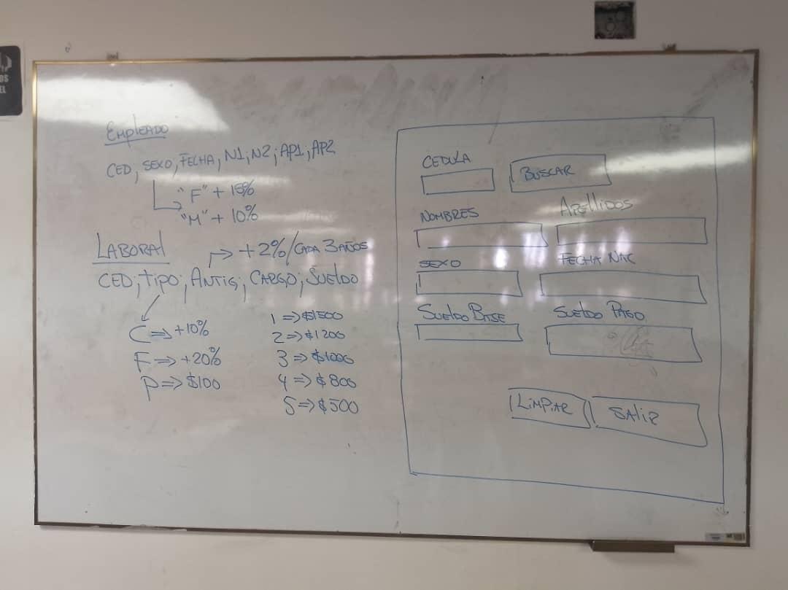

# 🧑‍💻 Salary Calculation Program

This is a Python application designed to calculate the **net salary** of employees based on specific parameters such as gender, job type, seniority, and base salary. The program interacts with CSV files containing employee and job-related data and offers a simple graphical user interface (GUI) built using **Tkinter**.

This is an evaluation I did with a friend on a test, which we did not finish 100% but at least most of the code worked, then I recovered the code and improved it a little more as there were some errors and I think it can continue to improve.

## 📜 Features
- **Employee Search:** Allows users to input an employee's ID (Cedula) and retrieve their personal and professional information.
- **Salary Calculation:** Computes the employee's net salary based on gender, job type, seniority, and other predefined rules.
- **CSV Integration:** Reads employee data from `PY_EMPLEADOS.csv` and job-related data from `PY_LABORAL.csv`.
- **Graphical User Interface:** A simple and clean GUI built with **Tkinter** to enhance user experience.

## 🛠️ Technologies Used
- **Python:** The main programming language for this project.
- **Tkinter:** For building the graphical user interface.
- **CSV Module:** For handling data input from CSV files.

## 📁 Project Structure
- **`PY_EMPLEADOS.csv:`** Stores personal information of employees such as ID, gender, date of birth, and names.
- **`PY_LABORAL.csv:`** Contains job-related data such as job type, seniority, and base salary.
- **`act.py:`** The main Python script that calculates the net salary and manages the graphical user interface.

## 💻 How It Works

1. The user inputs an employee's ID (Cedula).
2. The program retrieves the employee's data from the CSV files.
3. The net salary is calculated based on predefined rules:
    - Additional benefits for females.
    - Job type bonuses.
    - Seniority bonuses based on years worked.
4. The calculated net salary is then displayed in the GUI.

## 📷 Screenshot of the Statement (Task Description)


## 🚀 Getting Started

1. **Clone the repository:**
   ```
   git clone https://github.com/AnDev2804/netsalary.git
   ```
   
2. **Install necessary dependencies:**
   Ensure you have Python installed. The program does not require any additional external libraries beyond what comes with a standard Python installation.

3. **Prepare your CSV files:**
   Ensure that the `PY_EMPLEADOS.csv` and `PY_LABORAL.csv` files are correctly formatted and located in the root directory of the project.

4. **Run the application:**
   ```
   python act.py
   ```

## 🗂️ CSV File Format

### `PY_EMPLEADOS.csv`
This file should be formatted with the following columns:
```
Cedula;Gender;DateOfBirth;FirstName;SecondName;FirstSurname;SecondSurname
```

### `PY_LABORAL.csv`
This file should be formatted with the following columns:
```
Cedula;JobType;Seniority;Position;BaseSalary
```

## 📝 Example

Here’s an example of how the CSV files might look:

### `PY_EMPLEADOS.csv`
```
12345678;F;1990-05-12;Maria;Elena;Gonzalez;Perez
87654321;M;1985-11-03;Juan;Carlos;Martinez;Lopez
```

### `PY_LABORAL.csv`
```
12345678;C;10;1;$1500
87654321;F;5;3;$1000
```

## 📊 Calculation Rules

- Female employees receive a 15% salary increment.
- Male employees receive a 10% salary increment.
- Job type `C` adds a 10% bonus to the base salary.
- Job type `F` adds a 20% bonus.
- Job type `P` adds +$100.
- Seniority bonus is calculated as 2% for every three years of service.
- Fixed bonuses are provided based on job position:
    - Position 1: +$1500
    - Position 2: +$1200
    - Position 3: +$1000
    - Position 4: +$800
    - Position 5: +$500

## 🤝 Contributing
Feel free to fork this repository, make improvements, and submit a pull request! All contributions are welcome.

## 📄 License
This project is licensed under the MIT License.
